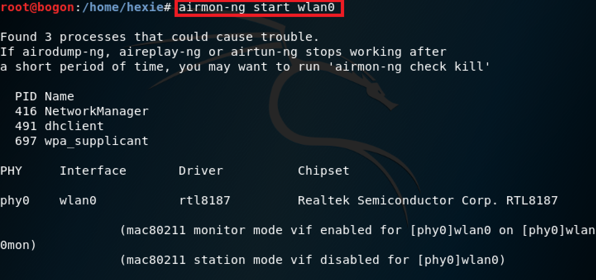
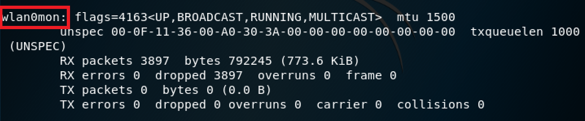
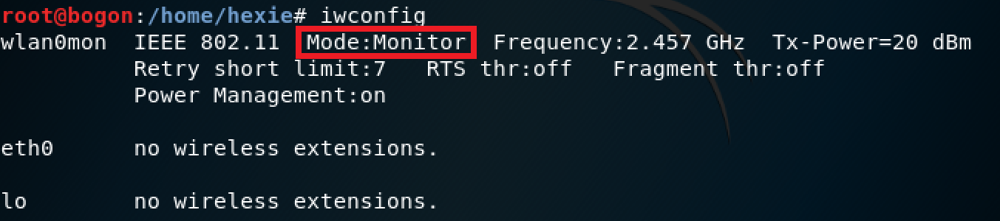
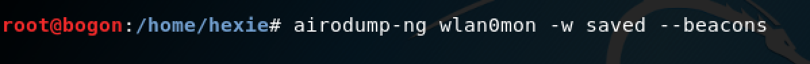
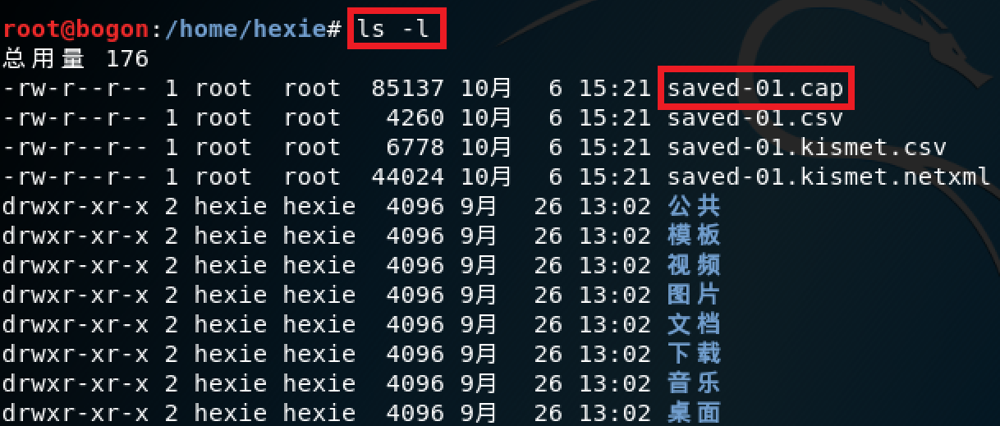
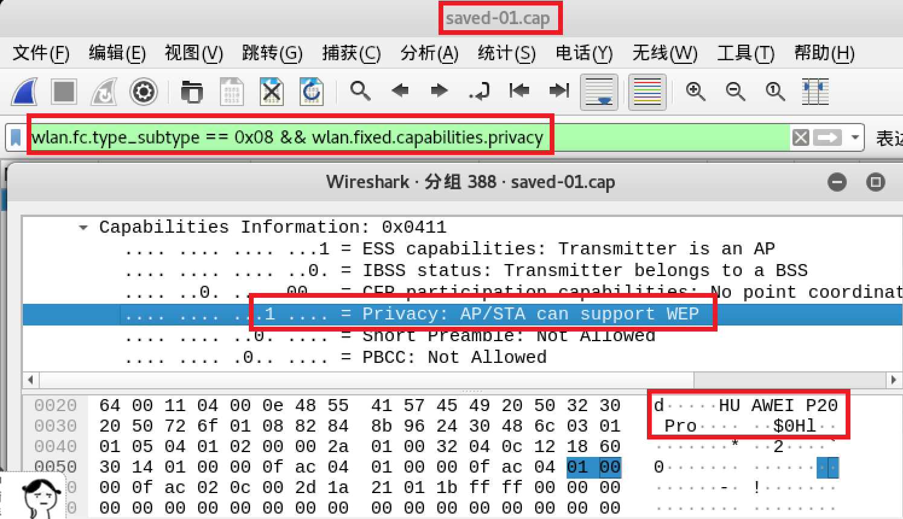

# 无线接入网监听实验

## 一、实验基础
### 802.11认证交互过程
1. AP广播**Beacon frame**，STA通过侦听AP定期发送的Beacon Frame（提供了BSS的一些基本信息，如BSSID、SSID、Channel等。）来发现BSS。
2. STA定向发送**Probe Request frame**，请求连接到某确定AP
3. AP回复**Probe Response frame** 表明自己收到了STA的Probe Request并且准许进行下一步动作——身份认证
4. STA定向发送**Authentication Request frame**请求进行身份认证
5. AP回复**Authentication Respose frame**
6. 至此，STA接入完毕，可以开始向AP传送数据帧
---

## 二、实验过程
- 设置wlan0工作在监听模式

- 检查无线网卡是否已处于启用状态，以下命令的输出中应出现网卡名：wlan0mon

- 检查无线网卡是否已切换到监听模式，wlan0mon的Mode应显示为：Monitor

- 监听并将结果保存到本地文件

- 查看本地保存文件


- 根据**saved-01.cap**文件提取beacon frame的**ssid**信息（**==Beacon Frame==** wlan.fc.type_subtype == **==0x08==**)

```
tshark -r 929-01.cap -Y wlan.fc.type_subtype==0x08 -T fields -e wlan.sa -e wlan.fixed.capabilities.privacy -e wlan.ssid | sort -d -u > beacon.list
```

```
beacon.list
00:27:1d:04:8b:2b	0	CMCC-WEB
00:27:1d:04:9d:27	0	CMCC-WEB
00:27:1d:04:9d:91	0	CMCC-WEB
00:27:1d:05:8b:2b	1	CMCC
00:27:1d:05:9d:27	1	CMCC
00:27:1d:05:9d:91	1	CMCC
00:27:1d:06:8b:2b	0	and-Business
00:27:1d:06:9d:27	0	and-Business
00:27:1d:06:9d:91	0	and-Business
06:74:9c:96:d0:d9	0	CUC-Guest
06:74:9c:97:66:89	0	CUC-Guest
06:74:9c:97:66:a2	0	CUC-Guest
06:74:9c:97:66:a7	0	CUC-Guest
06:74:9c:97:74:8f	0	CUC-Guest
06:74:9c:97:74:c1	0	CUC-Guest
06:74:9c:97:74:e9	0	CUC-Guest
0a:74:9c:96:d0:d9	1	CUC-WiFi
0a:74:9c:97:66:89	1	CUC-WiFi
0a:74:9c:97:66:a2	1	CUC-WiFi
0a:74:9c:97:66:a7	1	CUC-WiFi
0a:74:9c:97:74:8f	1	CUC-WiFi
0a:74:9c:97:74:c1	1	CUC-WiFi
0a:74:9c:97:74:e9	1	CUC-WiFi
b8:08:d7:cf:de:d3	1	Honor 8
e4:0e:ee:98:28:61	1	HUAWEI nova 3i
e4:0e:ee:ab:96:56	1	HUAWEI P20 Pro
```


- 根据**saved-01.cap**文件提取Probe Response的SSID信息（**==Probe Response==**  wlan.fc.type_subtype == **==0x05==**)


```
tshark -r saved-01.cap -Y wlan.fc.type_subtype==0x05 -T fields -e wlan.sa -e wlan.fixed.capabilities.privacy -e wlan.ssid | sort -d -u > response.list

```

```
response.list
00:27:1d:04:8b:2b	0	CMCC-WEB
00:27:1d:04:9d:91	0	CMCC-WEB
00:27:1d:05:8b:2b	1	CMCC
00:27:1d:06:8b:2b	0	and-Business
00:27:1d:06:9d:91	0	and-Business
06:74:9c:97:66:a7	0	CUC-Guest
06:74:9c:97:74:8f	0	CUC-Guest
0a:74:9c:96:d0:d9	1	CUC-WiFi
0a:74:9c:97:66:a7	1	CUC-WiFi
0a:74:9c:97:74:8f	1	CUC-WiFi
b8:08:d7:cf:de:d3	1	Honor 8
e4:0e:ee:ab:96:56	1	HUAWEI P20 Pro
```
---
## 三、 实验分析

#### 1. 查看统计当前信号覆盖范围内一共有多少独立的SSID？其中是否包括隐藏SSID？哪些无线热点是加密/非加密的？加密方式是否可知？

- **独立ssid**：8个
- **隐藏ssid有两种情况**
  - 广播了beacon帧但ssid为空的
  - 不广播beacon但回复probe response
  
  根据beacon.list和response.list，并没有发现符合上述两种情况的ssid，故本次实验中没有发现隐藏的ssid
- **判断无线热点是否加密**：在wireshark中筛选beacon帧，根据wlan.fixed.capabilities.privacy字段判断是否加密，若为0表示未加密，若为1表示加密
  - 按照如下过滤规则过滤
  - 以加密的无线热点HUAWEI P20 Pro为例（如下图）
   
```
wlan.fc.type_subtype == 0x08 && wlan.fixed.capabilities.privacy
```

   

 
- **判断无线热点加密方式**：加密方式可以通过**wlan.fixed.auth.alg**字段来进行获取，前提是有该字段的帧。

---

 
#### 2. 如何分析出一个指定手机在抓包时间窗口内在手机端的无线网络列表可以看到哪些SSID？这台手机尝试连接了哪些SSID？最终加入了哪些SSID？

- 非隐藏的ssid应该都可以出现在手机端的无线网络列表中，故当手机收到了AP广播的Beacon帧且SSID不为空时，指定手机才能在无线网络列表中看到该SSID
- 通过ProbeRequest帧可以判断手机尝试连接了哪些SSID
- 通过判断手机与哪些SSID交互了Association request和Association Response帧可以判断该手机最终加入了哪些SSID

#### 3. SSID包含在哪些类型的802.11帧？
- Beacon frame
- Probe request frame
- Probe response frame

---
### 参考链接
[2018-NS-Public-TheMasterOfMagic
](https://github.com/CUCCS/2018-NS-Public-TheMasterOfMagic/blob/6a0375bef1853cab614c466d0952e36918904b62/mis/mis-chap0x02.md)

[2018-NS-Public-FLYFLY-H](https://github.com/CUCCS/2018-NS-Public-FLYFLY-H/blob/misch0x02/ch0x02%20%E6%97%A0%E7%BA%BF%E6%8E%A5%E5%85%A5%E7%BD%91%E7%9B%91%E5%90%AC.md)


