# 基于virtualbox的网络基本攻防基础环境搭建

## 一、实验要求
- [ ] 靶机可以直接访问攻击者主机
- [ ] 攻击者主机无法直接访问靶机
- [ ] 网关可以直接访问攻击者主机和靶机
- [ ] 靶机的所有对外上下行流量必须经过网关
- [ ] 所有节点均可以访问互联网
- [ ] 所有节点制作成基础镜像（多重加载的虚拟硬盘）
---
## 二、实验环境
#### 1. 实验拓扑图
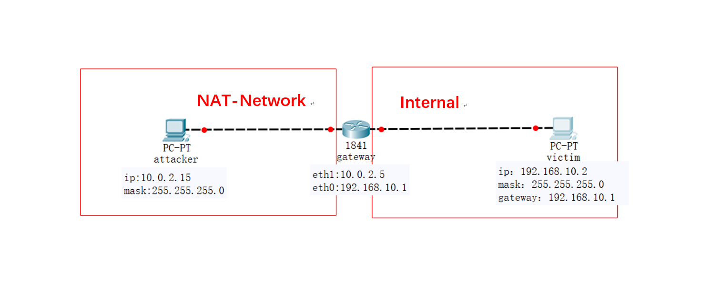
#### 2. 多重加载三台虚拟机
###### 安装kali虚拟机，打开虚拟介质管理器，点击释放虚拟机，并将虚拟机类型改为多重加载，以此建立三台实验虚拟机
- **attacker**: kali-linux-2018.3-amd64.iso
- **gateway**：kali-linux-2018.3-amd64.iso
- **victim**：kali-linux-2018.3-amd64.iso


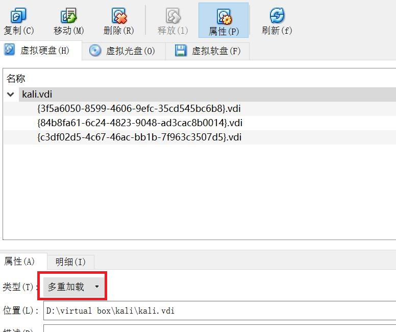

#### 3. 三台虚拟机网卡配置

- **attacker**
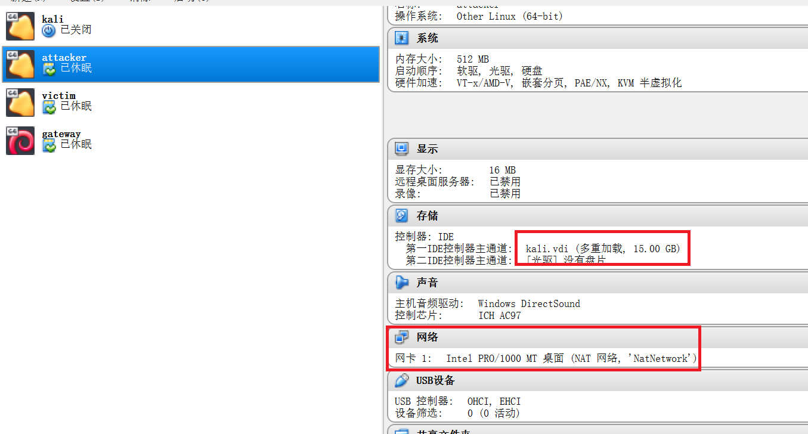
- **gateway** 
添加新NAT网络
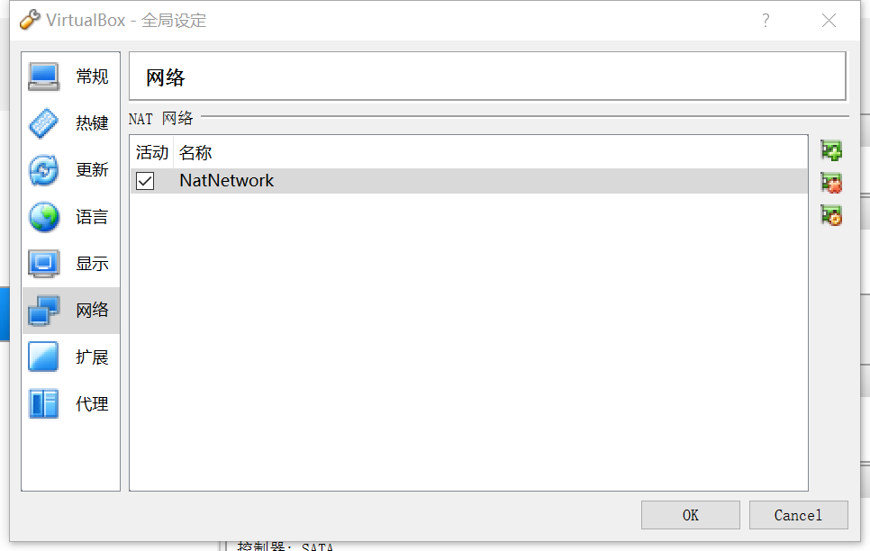

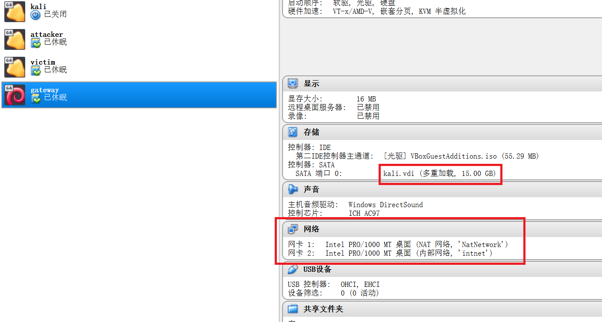
- **victim**
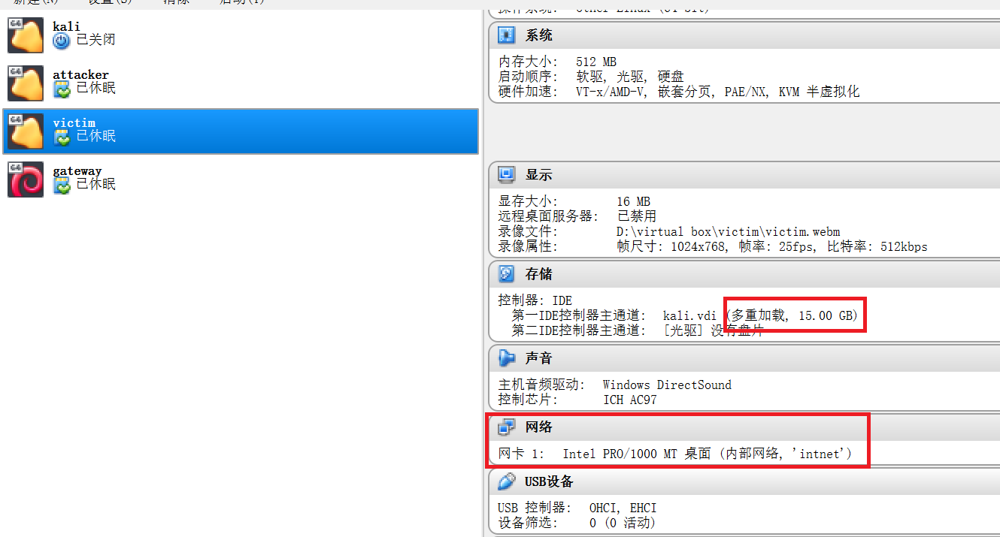


## 三、实验过程
#### 1. 配置IP（在/etc/network/interfaces文件中分别添加如下代码）
- **attacker**

```
allow-hotplug eth0
iface eth0 inet dhcp
```
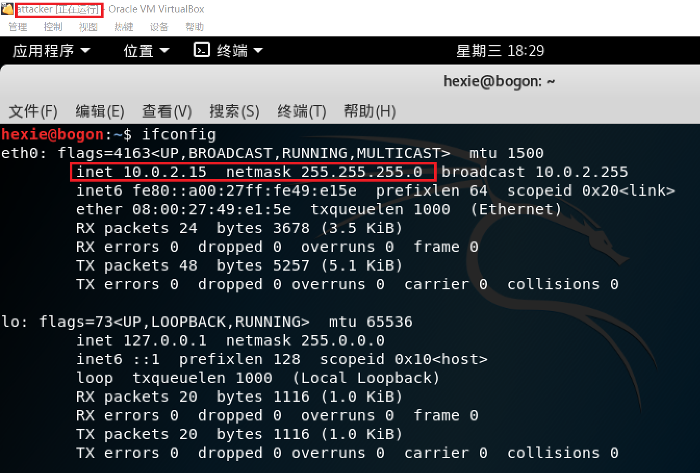
- **gateway**

```
allow-hotplug eth0
iface eth0 inet dhcp

allow-hotplug eth1
iface eth1 inet static
address 192.168.10.1
netmask 255.255.255.0
gateway 10.0.2.5
```
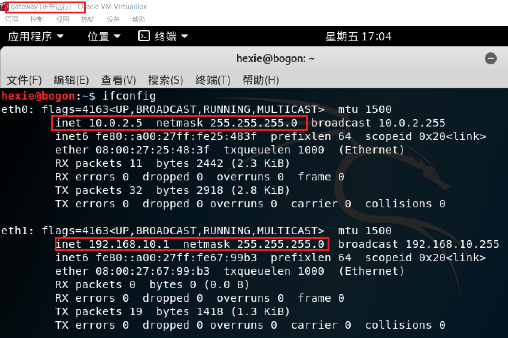

- **victim**

```
allow-hotplug eth0
iface eth0 inet static
address 192.168.10.2
netmask 255.255.255.0
gateway 192.168.10.1
```
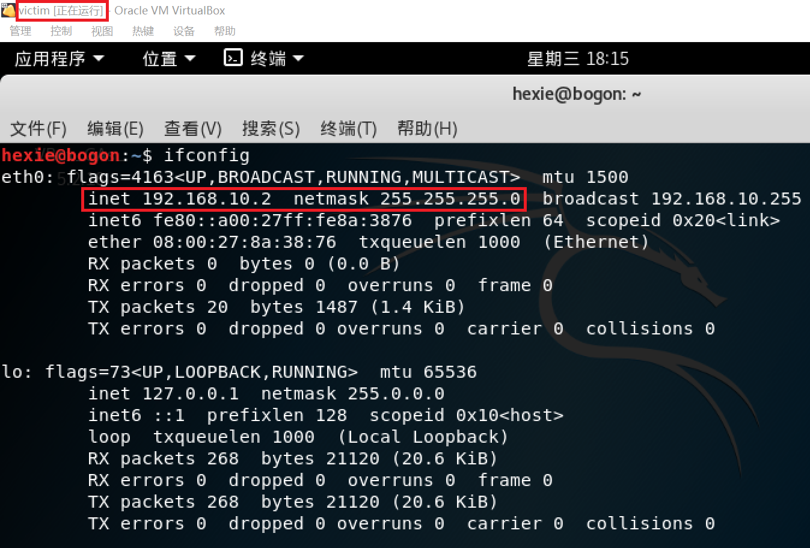


- 此时未开启ipv4转发，attacker和victim不能ping通，attacker与gateway能ping通，victim和gateway两个端口均能ping通

---

#### 2. 网关转发配置
###### gateway开启ipv4转发

```
echo 1 > /proc/sys/net/ipv4/ip_forward
```
- 这种方式修改只是暂时的，它的效果会随着计算机重启而失效 [参考](https://blog.csdn.net/jinzhichaoshuiping/article/details/53510779)
- 要想永久设置，需要etc/sysctl.conf，添加：

```
net.ipv4.ip_forward = 1
```

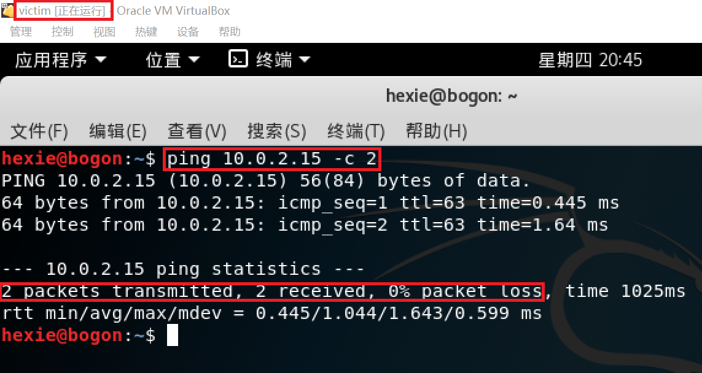
---
###### NAT设置

```
 ipatables -t nat -A POSTROUTING -o eth0 -s 196.168.10.0/24 -j MASQUERADE
```

#### 3.victim DNS配置 使其能访问互联网 
- 在靶机内手动加入公共服务器，在/etc/resolv.conf添加：
```
nameserve 8.8.8.8
```


---
## 四、实验结果
- [x] 靶机可以直接访问攻击者主机


- [x] 攻击者主机无法直接访问靶机
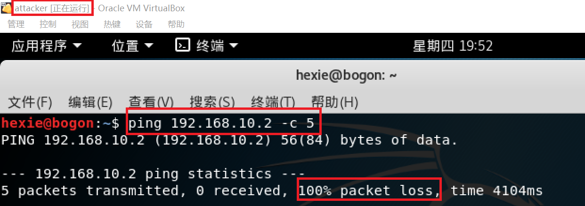
- [x] 网关可以直接访问攻击者主机和靶机
 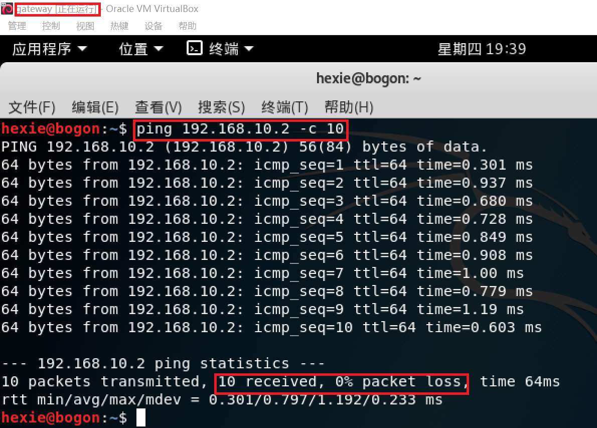


- [x] 靶机的所有对外上下行流量必须经过网关


- [x] 所有节点均可以访问互联网
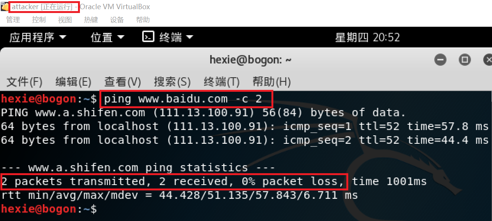
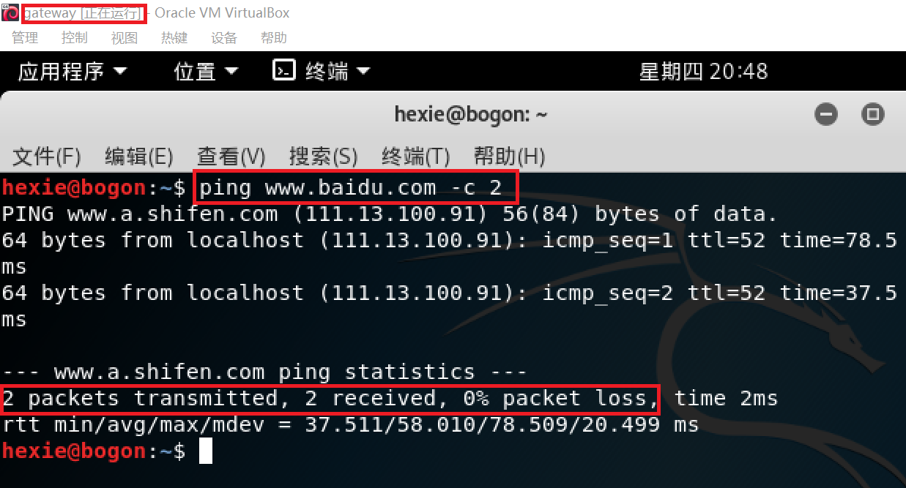
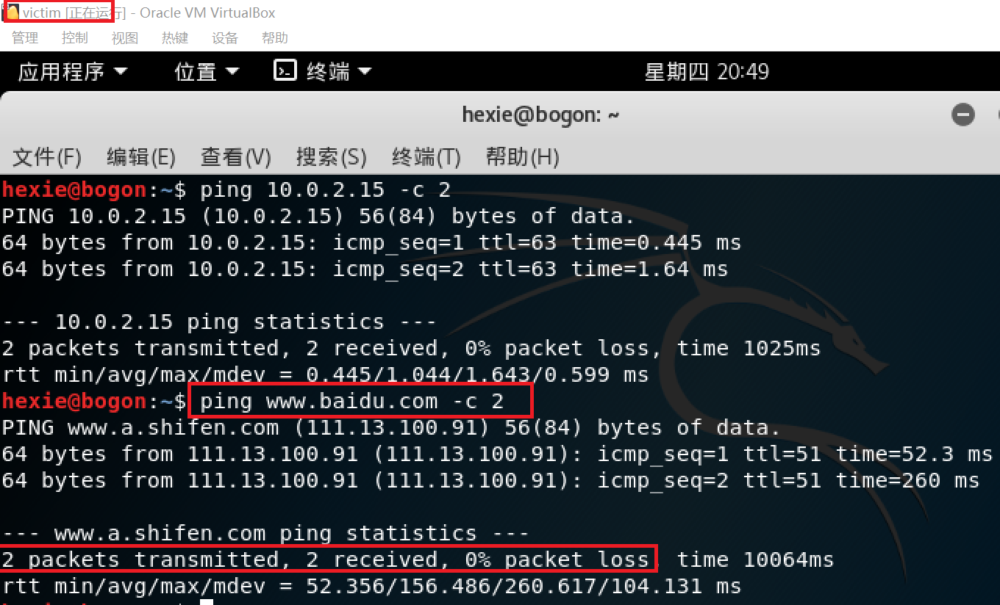
