# 实验五 利用Scapy库实现端口扫描

## 实验环境：
- 拓扑图如下：
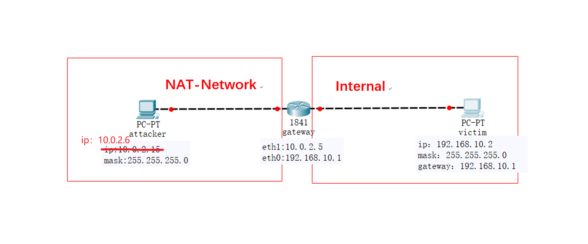
- 扫描者：gateway （10.0.2.5）
- 被扫描者：attacker（10.0.2.6）
## 一、TCP connect scan
- 代码：

```
#! /usr/bin/python

import logging
logging.getLogger("scapy.runtime").setLevel(logging.ERROR)
from scapy.all import *

dst_ip = "10.0.2.6"
src_port = RandShort()
dst_port=80

fin_scan_resp = sr1(IP(dst=dst_ip)/TCP(dport=dst_port,flags="F"),timeout=10)
if (str(type(fin_scan_resp))=="<type 'NoneType'>"):
    print "Open|Filtered"
elif(fin_scan_resp.haslayer(TCP)):
    if(fin_scan_resp.getlayer(TCP).flags == 0x14):
    print "Closed"
elif(fin_scan_resp.haslayer(ICMP)):
    if(int(fin_scan_resp.getlayer(ICMP).type)==3 and int(fin_scan_resp.getlayer(ICMP).code) in [1,2,3,9,10,13]):
        print "Filtered"
```
- 查看attacker80端口开启情况

```
nmap 10.0.2.6
```
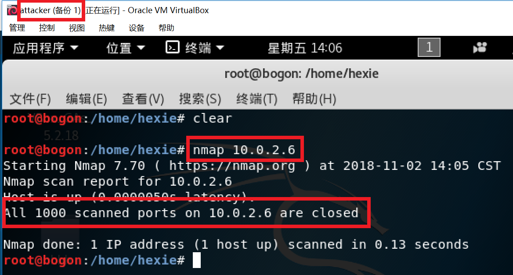
- 在attacker监听80端口并抓包保存到cap文件，同时在gateway运行脚本文件（**tcp_connect_scan.py**)

```
tcpdump -i eth0 -w 01.cap
```
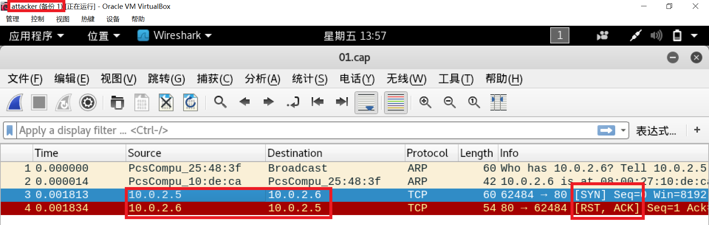
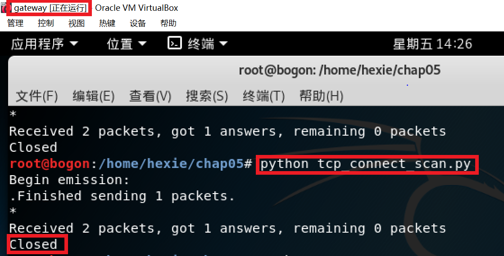

- 开启attacker80端口，重复上述操作

```
nc -lp 80 &
```
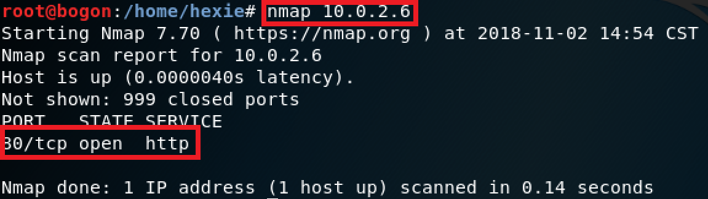
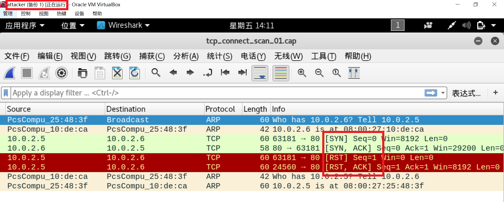
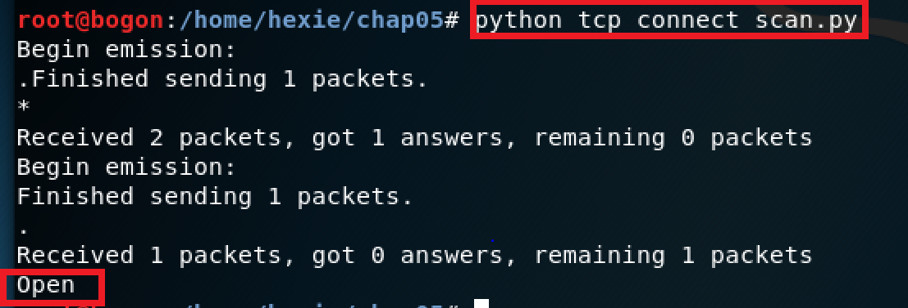
## 二、TCP stealth scan
- 代码：

```
#! /usr/bin/python

import logging
logging.getLogger("scapy.runtime").setLevel(logging.ERROR)
from scapy.all import *

dst_ip = "10.0.2.6"
src_port = RandShort()
dst_port=80

stealth_scan_resp = sr1(IP(dst=dst_ip)/TCP(sport=src_port,dport=dst_port,flags="S"),timeout=10)
if(str(type(stealth_scan_resp))=="<type 'NoneType'>"):
    print "Filtered"
elif(stealth_scan_resp.haslayer(TCP)):
    if(stealth_scan_resp.getlayer(TCP).flags == 0x12):
send_rst = sr(IP(dst=dst_ip)/TCP(sport=src_port,dport=dst_port,flags="R"),timeout=10)
        print "Open"
    elif (stealth_scan_resp.getlayer(TCP).flags == 0x14):
        print "Closed"
elif(stealth_scan_resp.haslayer(ICMP)):
    if(int(stealth_scan_resp.getlayer(ICMP).type)==3 and int(stealth_scan_resp.getlayer(ICMP).code) in [1,2,3,9,10,13]):
        print "Filtered"
```
- 未开启80端口前，在attacker监听80端口并保存cap文件，在gateway运行脚本文件（**tcp_stealth.cap**）

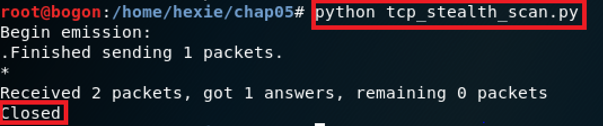
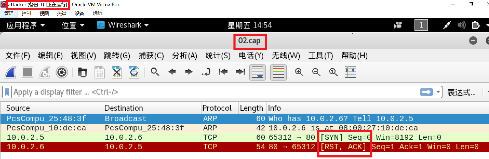


- 开启80端口后，重复上述操作

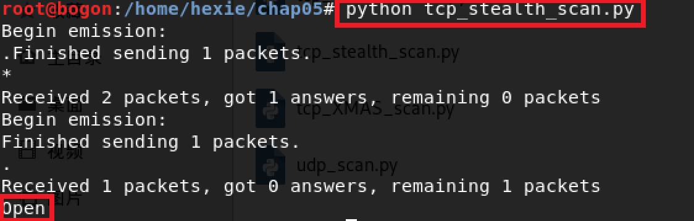
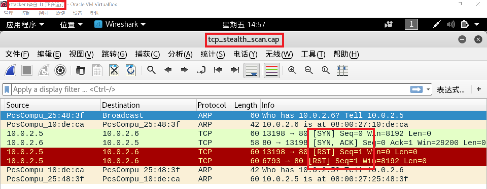


## 三、XMAS scan
- 代码

```
#! /usr/bin/python

import logging
logging.getLogger("scapy.runtime").setLevel(logging.ERROR)
from scapy.all import *

dst_ip = "10.0.2.6"
src_port = RandShort()
dst_port=80

xmas_scan_resp = sr1(IP(dst=dst_ip)/TCP(dport=dst_port,flags="FPU"),timeout=10)
if (str(type(xmas_scan_resp))=="<type 'NoneType'>"):
    print "Open|Filtered"
elif(xmas_scan_resp.haslayer(TCP)):
    if(xmas_scan_resp.getlayer(TCP).flags == 0x14):
        print "Closed"
elif(xmas_scan_resp.haslayer(ICMP)):
    if(int(xmas_scan_resp.getlayer(ICMP).type)==3 and int(xmas_scan_resp.getlayer(ICMP).code) in [1,2,3,9,10,13]):
        print "Filtered"
```
- 未开启80端口前，在attacker监听80端口并保存cap文件，在gateway运行脚本文件（**tcp_XMAS_scan.py**）

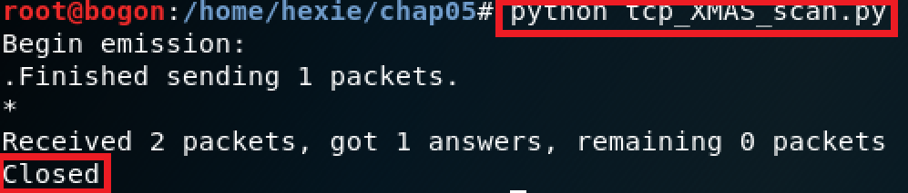
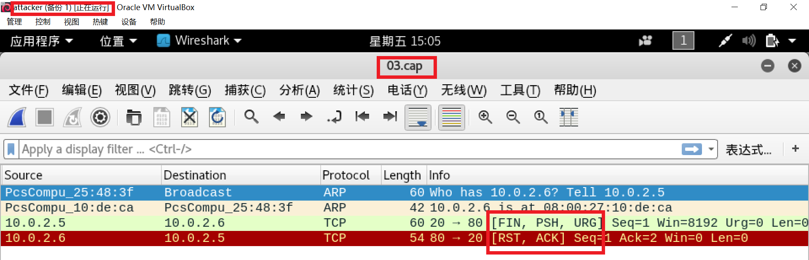


- 开启80端口后，重复上述操作

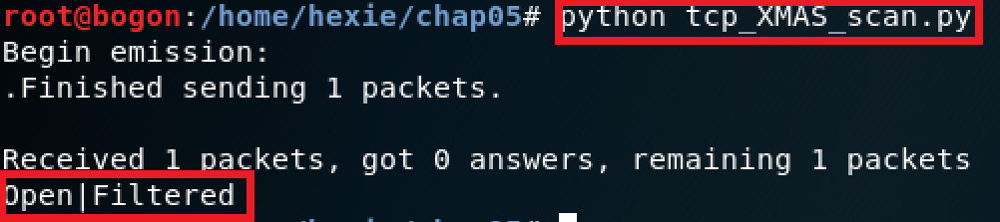
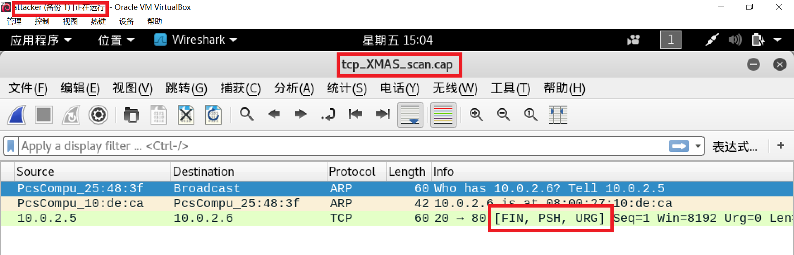


## 四、UDP scan
- 代码

```
import logging
logging.getLogger("scapy.runtime").setLevel(logging.ERROR)
from scapy.all import *

dst_ip = "10.0.2.6"
src_port = RandShort()
dst_port=53
dst_timeout=10

def udp_scan(dst_ip,dst_port,dst_timeout):
    udp_scan_resp = sr1(IP(dst=dst_ip)/UDP(dport=dst_port),timeout=dst_timeout)
    if (str(type(udp_scan_resp))=="<type 'NoneType'>"):
        retrans = []
        for count in range(0,3):
            retrans.append(sr1(IP(dst=dst_ip)/UDP(dport=dst_port),timeout=dst_timeout))
        for item in retrans:
            if (str(type(item))!="<type 'NoneType'>"):
                udp_scan(dst_ip,dst_port,dst_timeout)
        print "Open|Filtered"
    elif (udp_scan_resp.haslayer(UDP))or udp_scan_resp.getlayer(IP).proto == IP_PROTOS.udp:
        print "Open"
    elif(udp_scan_resp.haslayer(ICMP)):
        if(int(udp_scan_resp.getlayer(ICMP).type)==3 and int(udp_scan_resp.getlayer(ICMP).code)==3):
            print "Closed"
        elif(int(udp_scan_resp.getlayer(ICMP).type)==3 and int(udp_scan_resp.getlayer(ICMP).code) in [1,2,9,10,13]):
            print "Filtered"
    else:
        print "CHECK"

udp_scan(dst_ip, dst_port, dst_timeout)
```
- 53端口未开启前，在attacker监听并抓包，同时在gateway运行python脚本

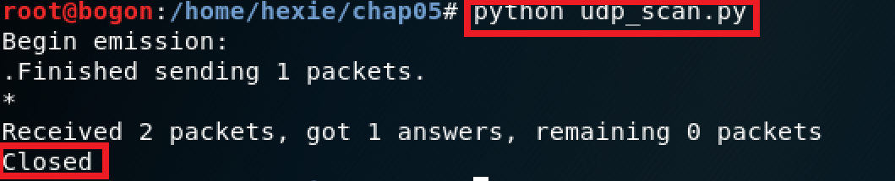
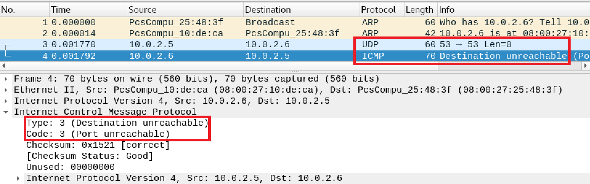


- 开启53端口，重复上述操作，从抓包结果可以看出，只有一个udp包，并没有回复。

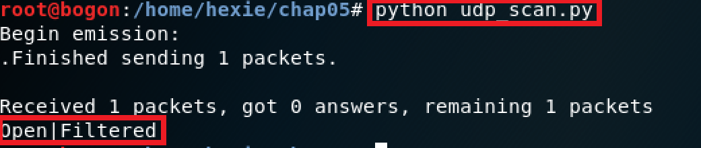
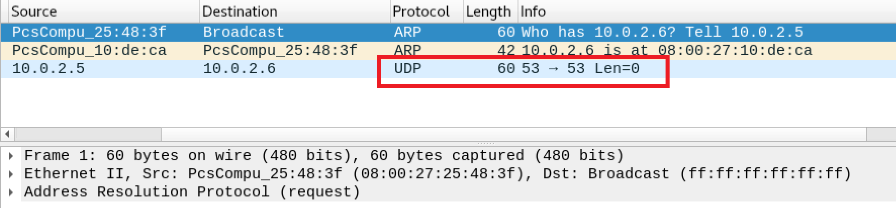

- 修改nc启动参数为 nc -u -l -p 53 < /etc/passwd ，同时修改脚本中 elif (udp_scan_resp.haslayer(UDP)): 为 elif (udp_scan_resp.haslayer(UDP) or udp_scan_resp.getlayer(IP).proto == IP_PROTOS.udp):
- UDP 监听可以按照目前的扫描逻辑判断为open状态。

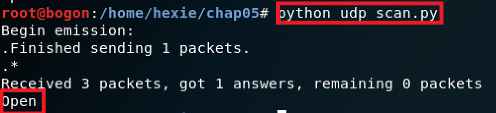
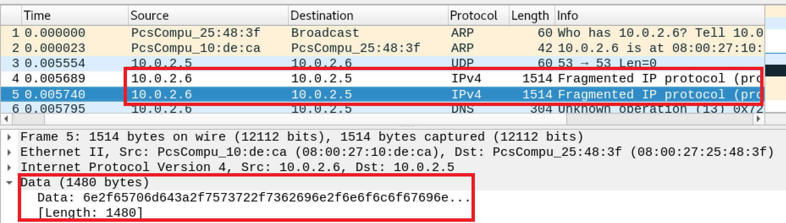


