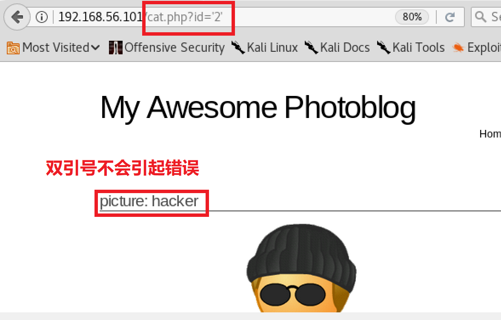
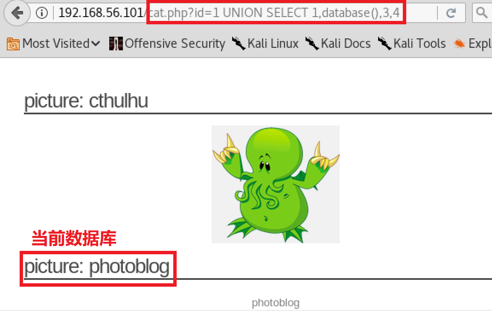
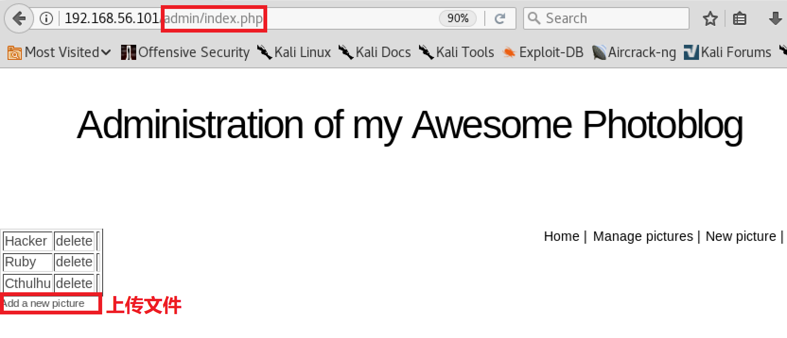

## 一、实验环境
- 新建虚拟机，加载from_sqli_to_shell_i386.iso镜像，并将网络模式设置为Host-only模式，作为服务器
- ipconfig查看IP地址为192.168.56.101

- 在宿主机访问192.168.56.101，看到网站首页，环境搭建成功

- 沿用之前实验中的攻击者环境，配置ip地址后并用ifconfig查看

- 保证攻击者能够ping通靶机

## 二、实验分析
- 实验目的：通过SQL注入获取网站管理员用户的账户密码、获取服务器相关信息
- 步骤：
     - 找到SQL注入点
     - 通过UNION/order by来判断列数并获得我们想要的信息
     - 通过UNION SELECT...来获取数据库、表、用户名、密码等信息
     - 获取密码后登录，上传webshell
---

## 三、实验具体过程
### 指纹识别
- 使用nmap扫描服务器，获取端口有关信息

- 使用nc向服务器发送http请求，获取服务器有关信息

### 通过分析找出可能的sql注入点，过程如下
- 查看网页源码发现许多php链接 

- 依次打开这些链接进行分析
    - “cat.php?id=1”表示 **SELECT * FROM cat WHERE id=1**
     

    - “cat.php?id=2”表示**SELECT * FROM cat WHERE id=2**
    
    - “cat.php?id=3”  表示 **SELECT * FROM cat WHERE id=3**
 
    - “/all.php”
 
  - “/admin/”
 

- 由上述可得，**http://192.168.56.101/cat.php?id=xxx**是可能的注入点，故依次判断
### 1.检测SQL注入点
- 基于整数

- 基于字符串

### 2.实现SQL注入
- 猜列数：
- 基于UNION
  - UNION前后select语句的列数必须一致，否则会报错

- 基于order by

- 可以得到一共有4列
### 3.获取信息

- 登录后页面

- 新建**test.php**文件并上传

- 在url执行cmd命令获取服务器信息
    - 查看内核信息

    - 查看/etc/passwd信息

    - 查看/etc目录下内容

### 参考文档
[from_sqli_to_shell/course](https://pentesterlab.com/exercises/from_sqli_to_shell/course)

[FLYFLY-H实验报告](https://github.com/CUCCS/2018-NS-Public-FLYFLY-H/blob/nsch0x07/From%20SQL%20Injection%20To%20Shell.md)