# 实战bro网络入侵取证
## 实验环境
- 安装bro

    ```apt-get install bro bro-aux```
- 查看bro的基本信息
    - 查看系统版本信息
    ```lsb_release -a ```
    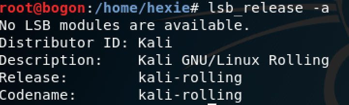
    - 查看系统名
    ```uname -a ```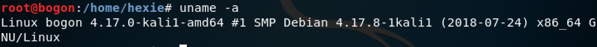
    - 查看bro版本信息
    ```bro -v ```

        
    
    
## 实验过程
- **编辑bro配置文件**
    - 编辑 ```/etc/bro/site/local.bro ```，在文件尾部追加两行新配置代码
        ```
        @load frameworks/files/extract-all-files
        @load mytuning.bro
        ```
        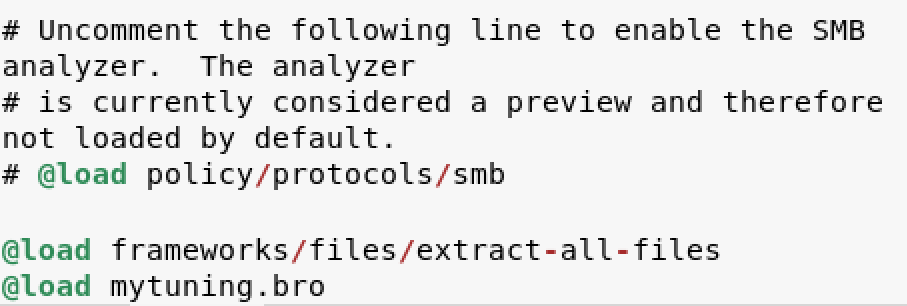
    - 在```/etc/bro/site/```目录下创建新文件mytuning.bro，内容为：
        ```
        redef ignore_checksums = T;
        ```
        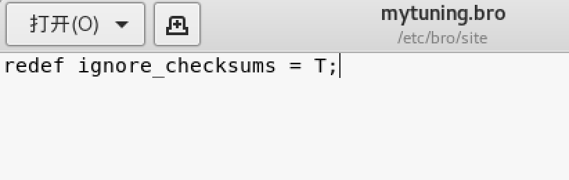
- **使用bro自动化分析pcap文件**
    - 下载attack-trace.pacp包文件
    - 执行命令：```bro -r attack-trace.pcap /etc/bro/site/local.bro```
    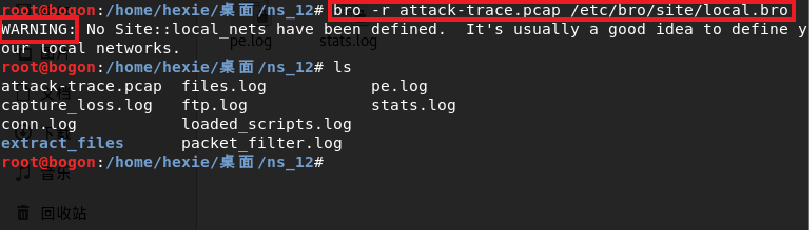
    - 出现warning，为解决该问题，在```mytuning.bro```文件中增添一行变量定义：
      ```
      redef Site::local_nets = { 192.150.11.0/24 };
      ```
    - 添加后重新运行指令，警告解决，发现新增添了两个```.log```文件以及一个extract_files目录，在该目录下我们会发现有一个文件```file extract-1240198114.648099-FTP_DATA-FHUsSu3rWdP07eRE4l```。
    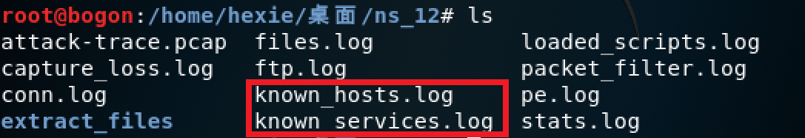
    - 将该文件上传到[VirusTotal](https://www.virustotal.com/#/home/upload)，发现是已知的后门程序，因此可以进行逆向倒推，寻找入侵线索
    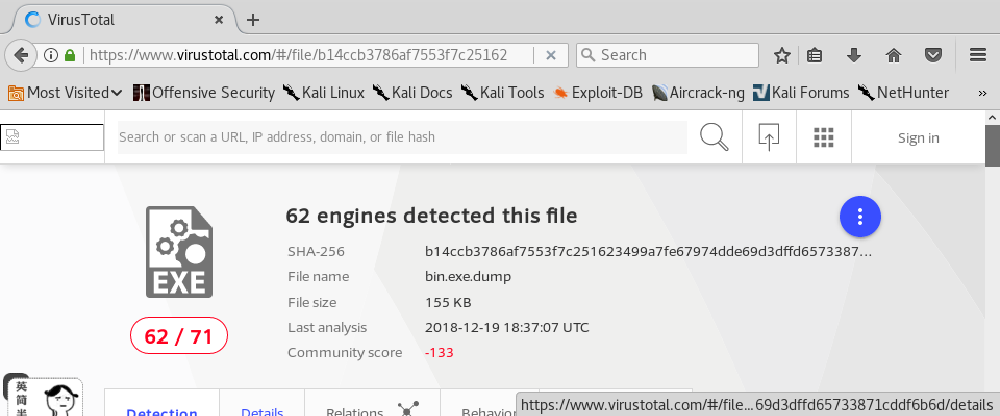
    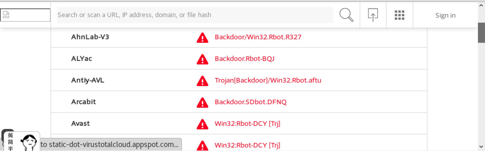
    - 阅读```/usr/share/bro/base/files/extract/main.bro```源代码，发现**文件名的最右一个-右侧对应的字符串FHUsSu3rWdP07eRE4l**是```files.log```中的文件唯一标识
    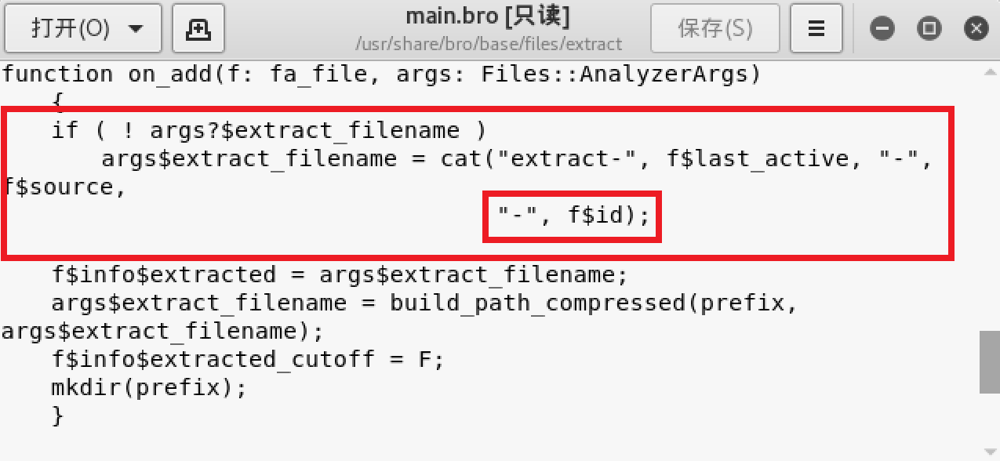
 
    - 通过查看```files.log```，发现该文件提取自网络会话标识（bro根据IP五元组计算出的一个会话唯一性散列值）为```CX3s0R2YQ8e8sDoBba```的FTP会话。
    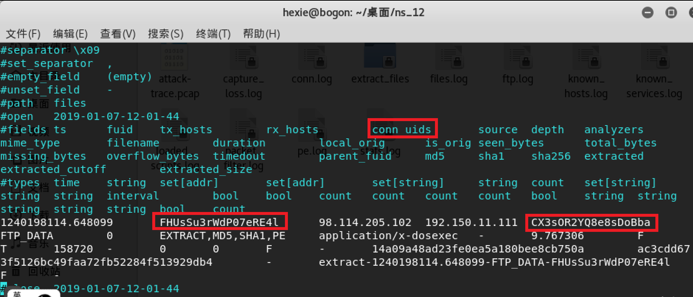
    - 该```CX3s0R2YQ8e8sDoBba```会话标识在```conn.log```中可以找到对应的IP五元组信息。
    - 查看conn.log，找到对应的IP五元组信息。我们发现该PE文件来自于IPv4地址为：```98.114.205.102```的主机
    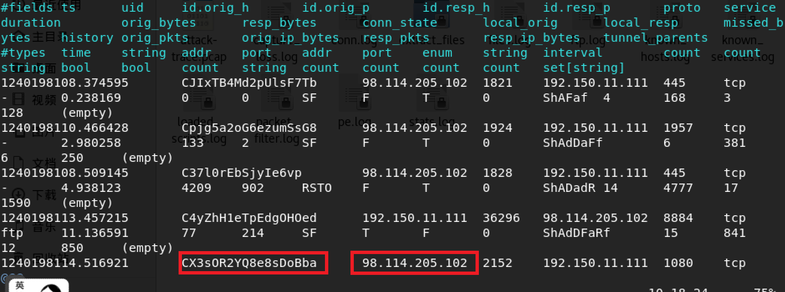
    
    
    
    
**参考**
- [sec.cuc.edu.cn](https://sec.cuc.edu.cn/huangwei/textbook/ns/chap0x12/exp.html)


    
   
